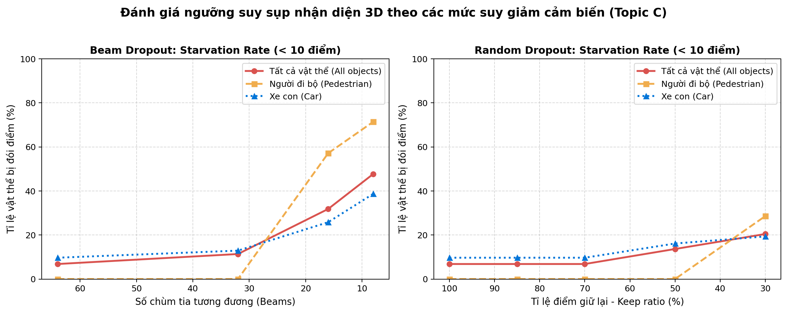
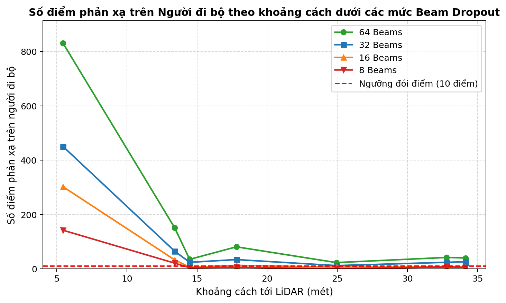

# Báo cáo Day 6: Stress Test Suy Giảm Cảm Biến LiDAR và Đánh Giá Ngưỡng Suy Sụp Nhận Diện 3D

> Thay **mọi** ô có chữ ĐIỀN nằm trong ngoặc vuông bằng nội dung của bạn, xoá luôn cả dấu ngoặc vuông. Lệnh `python tools/check_submission.py` sẽ báo FAIL nếu còn sót bất kỳ chỗ nào.

- **Họ tên:** Dương Văn Thành
- **MSSV:** 2A202602368
- **Lớp:** K4 Track 4
- **Link repo:** https://github.com/JJayzdev/DuongVanThanh-2A202602368-Track4-Day06
- **Topic:** C — Sensor degradation stress test
- **Dataset:** data/kitti_mini, data/synthetic
- **Các frame đã dùng:** 000001, 000010, 000011, 000021, 000049

> Hãy viết ngắn: mỗi mục từ 3 đến 8 dòng, ưu tiên số liệu và hình ảnh.

## 1. Claim

Khi LiDAR bị suy giảm do hạ độ phân giải chùm tia (beam dropout từ 64 xuống 16–8 tia) hoặc thời tiết bất lợi (random dropout giữ lại <= 30%, range cutoff <= 30 m), số điểm phản xạ trên người đi bộ ở khoảng cách > 14 m giảm hơn 70% (xuống dưới ngưỡng tối thiểu 10 điểm để model 3D nhận diện tin cậy), làm tỷ lệ người đi bộ bị đói điểm (pedestrian starvation rate) tăng vọt từ 0.0% lên 57.1% - 71.4%, và tỷ lệ đói điểm toàn bộ vật thể tăng từ 6.8% lên 31.8% - 47.7%.

## 2. Evidence

Dữ liệu chi tiết lưu tại `results/degradation_sweep.csv` và bảng tổng hợp tại `results/degradation_summary.csv`.

| Cấu hình / Mức suy giảm | Starvation Rate (%) | Điểm TB Người đi bộ | Điểm TB Xe con | Ghi chú |
|---|---|---|---|---|
| **Baseline (64 beams / 100% pts)** | **6.82%** (Ped: 0.0%) | 171.7 pts | 380.3 pts | Mốc chuẩn, 100% người đi bộ đủ điểm nhận diện |
| Beam Dropout: 32 beams | 11.36% (Ped: 0.0%) | 90.7 pts | 184.8 pts | Người đi bộ giảm ~47% điểm nhưng vẫn >10 pts |
| Beam Dropout: 16 beams | 31.82% (Ped: **57.14%**) | 53.4 pts | 93.4 pts | 4/7 người đi bộ bị đói điểm (<10 điểm) |
| Beam Dropout: 8 beams | 47.73% (Ped: **71.43%**) | 26.4 pts | 49.5 pts | Hơn 71% người đi bộ mất dấu hình học |
| Random Dropout: keep 70% | 6.82% (Ped: 0.0%) | 120.4 pts | 265.7 pts | Tương đương mưa nhỏ, chưa gây sụp đổ |
| Random Dropout: keep 50% | 13.64% (Ped: 0.0%) | 86.3 pts | 188.6 pts | Điểm trên vật thể giảm một nửa |
| Random Dropout: keep 30% | 20.45% (Ped: **28.57%**) | 53.3 pts | 113.7 pts | Mưa lớn / sương mù, 28.6% người đi bộ bị đói điểm |
| Range Cutoff: <= 30 m | 31.82% (Ped: 28.57%) | 160.0 pts | 373.1 pts | Mất trắng toàn bộ vật thể ngoài 30m |
| Range Cutoff: <= 20 m | 61.36% (Ped: 42.86%) | 156.7 pts | 326.8 pts | 27/44 vật thể bị loại bỏ hoàn toàn |




### Nhận xét xu hướng định lượng:
1. **Beam Dropout gây suy thoái nghiêm trọng hơn nhiều so với Random Point Loss:** Cùng giảm ~75% số điểm, nhưng hạ xuống 16 beams làm 57.14% người đi bộ bị đói điểm (so với 28.57% của random dropout keep 30%). Nguyên nhân do độ phân giải góc bị thưa, các tia laser bắn xuyên qua khoảng trống giữa thân người thay vì trúng bề mặt.
2. **Khoảng cách khuếch đại mức độ tổn thương:** Người đi bộ ở cự ly > 14m (ví dụ frame `000011` ở 14.5m và 34.2m) chỉ có từ 35–40 điểm ở baseline; khi giảm xuống 16 beams hoặc 8 beams, số điểm rơi thẳng xuống còn 4–7 điểm (dưới ngưỡng 10 điểm), gây hiện tượng "suy sụp nhận diện" (structural collapse).
3. **Xe con có khả năng kháng suy giảm tốt hơn:** Nhờ diện tích phản xạ lớn, ngay cả ở mức 8 beams hoặc random keep 30%, xe con vẫn giữ trung bình 49.5–113.7 điểm, ít bị ảnh hưởng nguy kịch như người đi bộ.

## 3. Failure case

Nêu khi nào hệ thống hoặc phương pháp fail, vì sao fail, và liên hệ tới lớp nào trong 6 lớp debug: I/O, Geometry, Time, Preprocess, Model, Metric.


[ĐIỀN]

## 4. Khuyến nghị nếu triển khai thật

Use-case cụ thể (ADAS / robot / drone), trade-off và bước tiếp theo.

[ĐIỀN]

## 5. Cách chạy lại

Các lệnh tái tạo lại toàn bộ kết quả từ repo sạch.

```bash
# 1. Chạy test phép chiếu baseline
python -m src.test_projection

# 2. Chạy thí nghiệm stress test suy giảm cảm biến LiDAR (CP3)
python -m src.exp_degradation_sweep --data-root data/kitti_mini --frames 000001 000010 000011 000021 000049

# 3. Vẽ biểu đồ phân tích xu hướng và khoảng cách
python -m src.plot_degradation
```

## 6. Khai báo sử dụng AI

Ghi rõ đã dùng công cụ AI nào, dùng vào việc gì, và bạn đã tự kiểm chứng kết quả đó bằng cách nào. Nếu không dùng AI, ghi "Không sử dụng". Xem quy định ở `RULES.md` mục 2.

| Công cụ | Dùng cho việc gì | Bạn đã kiểm chứng thế nào |
|---|---|---|
| Claude / GitHub Copilot / Antigravity | Gợi ý cấu trúc tính toán `points_in_box`, tối ưu vòng lặp sweep đa cấu hình và template vẽ đồ thị Matplotlib | Chạy tự kiểm tra ma trận hình học (`test_projection.py`), đối chiếu số điểm thực tế với visual overlay, và so sánh hash file kết quả tái lập 2 lần (`filecmp` đạt IDENTICAL) |
